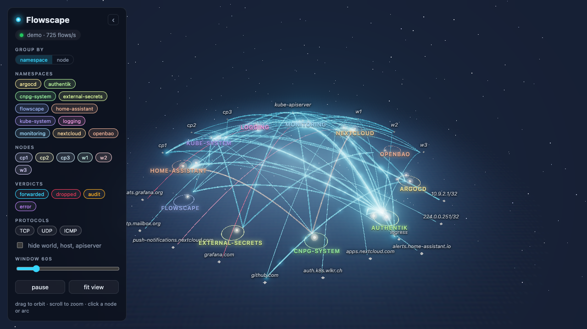
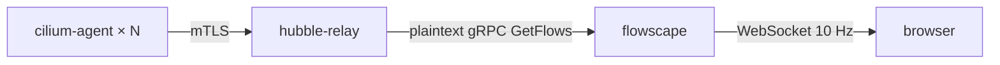

# Flowscape

A live 3D map of the network traffic inside a Kubernetes cluster, fed by
[Cilium Hubble](https://docs.cilium.io/en/stable/observability/hubble/).
Namespaces are platforms on a ring, workloads are the lights on them, and
every conversation is an arc with sparks travelling along it: cyan when the
packets were forwarded, red when a policy dropped them, amber when a policy in
audit mode would have.



**[Live demo](https://janwelker.github.io/flowscape/)**: the demo source and
the graph compiled to WebAssembly, running in your browser on a synthetic
homelab cluster. Same code as the server, minus the WebSocket.

## How it works



The Go binary opens one `GetFlows` stream with `follow` set, folds each flow
into a graph keyed by workload (namespace, kind, name) and by conversation
(source, destination, protocol, port), keeps five minutes of per-second
counters per conversation, and pushes deltas to every browser ten times a
second. The browser owns the layout, the rates, the time window and the
particles, so the server holds no per-client state beyond the socket.

Reserved Cilium identities (`world`, `kube-apiserver`, `ingress`) are anchors
on an outer ring; `world` is split by the DNS name the Hubble DNS proxy
resolved, so `github.com` and `smtp.mailbox.org` are separate lights.

The cluster's machines come from the stream too. The agent that reports a
flow runs on the source's node for egress and on the destination's for
ingress, so every workload learns which node its pods run on, and the
`host` and `remote-node` identities resolve to the machines themselves:
`host` is the observing node, and a `remote-node` address is named as soon
as a flow on that machine has shown it as `host`. The machines sit at the
back of the outer ring next to the API server, each workload's halo carries
its machine's tint, and **Group by → node** swaps the namespace platforms for
one platform per machine, which turns the arcs between platforms into the
traffic that actually crosses the network.

## Run it

Without a cluster, the demo source synthesises flows for a small homelab:

```bash
go run ./cmd/flowscape --demo
open http://localhost:8080
```

Against a real cluster from a laptop:

```bash
kubectl -n kube-system port-forward svc/hubble-relay 4245:80 &
go run ./cmd/flowscape --hubble-relay-addr 127.0.0.1:4245
```

Record a session and play it back later, at any speed:

```bash
hack/capture-flows.sh 60 flows.jsonl
go run ./cmd/flowscape --replay-file flows.jsonl --replay-speed 4
```

In the cluster: one Deployment, one Service, an ingress rule on the
`hubble-relay` network policy and whatever authenticates the hostname. The
manifests the author runs are in
[homelab-apps](https://github.com/JanWelker/homelab-apps/tree/main/flowscape);
what they need from the app is in [`deploy/README.md`](deploy/README.md).

## Configuration

Every flag has an environment variable of the same meaning.

| Flag | Env | Default | Meaning |
| --- | --- | --- | --- |
| `--listen` | `LISTEN_ADDR` | `:8080` | UI, `/ws`, `/api/*`, `/healthz`, `/readyz` and `/metrics` |
| `--hubble-relay-addr` | `HUBBLE_RELAY_ADDR` | `hubble-relay.kube-system.svc.cluster.local:80` | Relay, plaintext gRPC |
| `--window` | `WINDOW` | `60s` | Default rate window in the UI and the warm-up `since` on connect |
| `--retention` | `RETENTION` | `300s` | Ring depth per conversation, idle expiry, largest window |
| `--tick` | `TICK` | `100ms` | WebSocket delta interval |
| `--spark-rate` | `SPARK_RATE` | `200` | Sampled flow events per second sent to each browser |
| `--allowed-origins` | `ALLOWED_ORIGINS` | `localhost:*,127.0.0.1:*` | WebSocket `Origin` patterns; set to the public hostname |
| `--exclude-pods` | `EXCLUDE_PODS` | relay, Hubble UI, flowscape | `namespace/pod-prefix` pairs filtered out at the relay |
| `--demo`, `--demo-scale`, `--demo-speed` | `DEMO`, … | off | Synthetic flows; scale replicates the topology for load tests |
| `--replay-file`, `--replay-speed`, `--replay-loop` | `REPLAY_FILE`, … | off | Play a `hubble observe -o jsonpb` capture |
| `--log-level` | `LOG_LEVEL` | `info` | JSON logs on stdout |

`/readyz` answers 200 as soon as the flow source is running. A Relay outage
shows as a red status pill in the UI and `flowscape_relay_connected 0` in
the metrics, on purpose: behind a reverse proxy a failing readiness probe
would turn a data outage into a 502.

## In the browser

| Control | Effect |
| --- | --- |
| Drag, scroll | Orbit and zoom; the scene auto-rotates until the first drag |
| Click a light or an arc | Details: counters, rates over the window, ports, HTTP paths and DNS names seen at L7, drop reasons |
| Group by | Platforms are namespaces or nodes; switching animates the regrouping and refits the view |
| Namespace chips | Hide a namespace; alt-click shows only that one |
| Node chips | Hover to highlight the workloads on that machine, click to hide them; a red dot marks a node Relay cannot reach |
| Verdict and protocol chips | Hide arcs and sparks of that kind |
| Window slider | 10 s to the retention; rates and the sparkline follow |
| `space` | Pause; ticks are buffered for a minute, longer than that reconnects for a fresh snapshot |
| `f` | Fit the ring into the view |
| `h`, or the ‹ button | Collapse the controls to the status pill; remembered per browser |
| `?debug` in the URL | Frame rate and object counts |

## Development

```bash
make dev        # go run --demo on :8080 plus Vite with hot reload on :5173
make test       # go vet, go test -race, vitest
make lint       # golangci-lint, eslint
make web        # build the frontend into web/dist; the Go binary embeds it
make pages      # the GitHub Pages demo: Go demo source as WebAssembly plus the frontend
make e2e        # Playwright: the server build and the pages build, writes docs/screenshot.png
make image      # container build with Apple's container CLI
```

The Hubble API comes straight from the `github.com/cilium/cilium` module,
pinned to the cluster's Cilium minor; Renovate leaves that one alone.

## Releases

Tags are semver, `vX.Y.Z` on `main`. Each tag publishes the image as
`ghcr.io/janwelker/flowscape:X.Y.Z` and `X.Y` with a provenance attestation,
and a [GitHub release](https://github.com/JanWelker/flowscape/releases) with
generated notes and static binaries for Linux and macOS:

```bash
curl -sSL https://github.com/JanWelker/flowscape/releases/latest/download/flowscape_0.2.0_darwin_arm64.tar.gz | tar xz
./flowscape_0.2.0_darwin_arm64/flowscape --demo
```

## Metrics

Prefixed `flowscape_`: flows received and skipped by reason, relay connection
state, reconnects and unavailable nodes, lost events, graph size, connected
browsers, dropped ticks, tick duration, and `build_info`.

## License

MIT.
